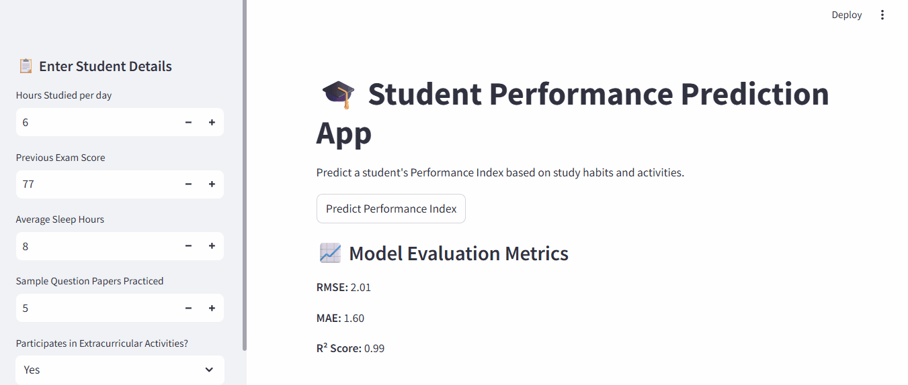

🎓 Student Performance Prediction App

Overview
This project predicts a student’s performance index based on their study habits, sleep, previous exam scores, and extracurricular activities using a Linear Regression model.
It’s a complete end-to-end machine learning pipeline — from data preprocessing to model deployment using Streamlit.

### 🎬 App Demo



🚀 Features
Preprocessing using ColumnTransformer and Pipeline
Linear Regression model built and evaluated end-to-end
Model persistence using Joblib
Interactive web app built with Streamlit
Predicts Performance Index based on user inputs

🧾 Dataset

Dataset: https://www.kaggle.com/datasets/nikhil7280/student-performance-multiple-linear-regression/data

| Feature | Description |
|----------|-------------|
| Hours Studied | Average study hours per day |
| Previous Scores | Previous exam performance |
| Sleep Hours | Average sleep duration |
| Sample Question Papers Practiced | No. of practice papers |
| Extracurricular Activities | Whether student participates (Yes/No) |
| Performance Index | Target variable (predicted) |

🧭 Project Workflow
| Step | Description |
|------|-------------|
| **1. Data Collection** | Collected student performance dataset (CSV file) containing study hours, sleep, previous scores, etc. |
| **2. Data Preprocessing** | Cleaned data by handling missing values and encoding categorical variables. |
| **3. Exploratory Data Analysis (EDA)** | Visualized feature relationships using Seaborn and Matplotlib to understand performance patterns. |
| **4. Feature Selection** | Selected important features influencing student performance. |
| **5. Model Building** | Trained a Linear Regression model to predict performance index. |
| **6. Model Evaluation** | Evaluated model performance using metrics like R² score and Mean Absolute Error. |
| **7. Model Saving** | Saved the trained model using Joblib for future predictions. |
| **8. Streamlit App Development** | Built an interactive web app for real-time student performance prediction. |
| **9. Deployment** | Deployed the app on Streamlit Cloud using GitHub repository. |

### 🧠 Tech Stack
| Category | Tools / Libraries |
|-----------|------------------|
| **Programming Language** | Python |
| **Data Analysis** | Pandas, NumPy |
| **Visualization** | Matplotlib, Seaborn |
| **Machine Learning** | Scikit-learn |
| **Model Persistence** | Joblib |
| **Web App Framework** | Streamlit |
| **Version Control & Hosting** | GitHub |

### ⚙️ How to Run Locally
1. **Clone the repository**
   ```bash
   git clone https://github.com/harikadesu/student-performance-app.git
   cd student-performance-app
2. **Install dependencies**
    ```bash
    pip install -r requirements.txt
3. **Run the Streamlit app**
    ```bash
    streamlit run app.py
4. **Open in browser**
    Streamlit will show a local URL — click it or open manually to view the app


---


### 💡 Future Improvements
- Add more advanced models (Random Forest, XGBoost).  
- Include feature importance visualization.  
- Allow users to upload their own datasets for prediction.  
- Improve UI with charts and dynamic feedback.  
- Deploy using Docker or on cloud services like AWS or Azure.

### 🙌 Acknowledgements
- **Dataset:** Student performance dataset used for educational purposes.  
- **Libraries:** Thanks to the open-source community for libraries like Pandas, Scikit-learn, and Streamlit.  
- **Inspiration:** This project was created to practice Machine Learning model deployment and web app development.
